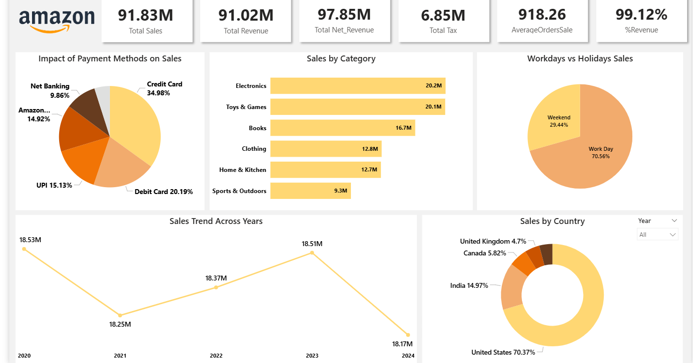
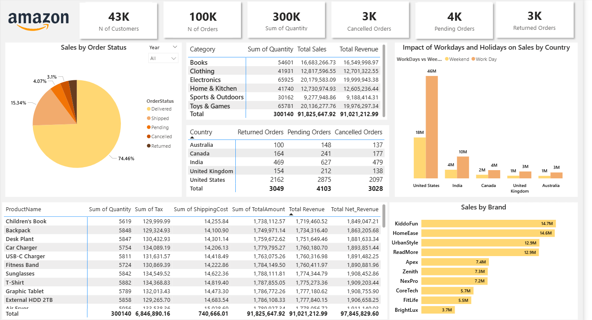

# 📊 Amazon E-Commerce Sales Analysis

### Power BI • DAX • Data Modeling • Dashboard

## 🔍 Project Overview

This project presents an end-to-end **E-commerce Sales Analysis** built using **Power BI**, based on a synthetic Amazon-style dataset. The goal is to analyze sales performance, customer behavior, order statuses, and operational issues (cancellations & returns) to generate **business-driven insights** and actionable recommendations.

---

## 📂 Dataset Description

This dataset contains **100,000 synthetic Amazon-style e-commerce sales transactions**, designed to closely resemble real-world online retail behavior. It includes **20 clean and well-structured columns** covering:

* Customers
* Products & Categories
* Pricing & Discounts
* Taxes & Shipping Costs
* Payment Methods
* Logistics
* Order Status (Delivered, Cancelled, Returned, Pending)

---

## 🛠 Tools & Technologies

* **Power BI Desktop**
* **DAX** (Measures & Calculated Columns)
* **Power Query** (Data Validation)

---

## 🧹 Data Preparation & Modeling

* Validated dataset (no errors, duplicates, or missing values)
* Performed **Query Optimization** in Power Query by splitting a single flat table into:

  * **Products Dimension Table**
  * **Customers Dimension Table**
* Reduced redundancy and improved data model efficiency
* Created a **Calendar Table** using `CALENDAR()` function
* Built relationships between fact and dimension tables

---

## 📐 DAX Measures

* Total Sales
* Total Revenue
* Total Net Revenue
* Total Tax
* Sum of Quantities
* Number of Orders
* Number of Customers
* Cancelled Orders Count
* Pending Orders Count
* Returned Orders Count
* Average Order Sale
* Revenue Percentage (%)

---

## 📊 Dashboards Overview

### 1️⃣ Sales Performance Dashboard

Focuses on overall business performance:

* Sales trend across years
* Sales by category
* Sales by country
* Impact of payment methods
* Workdays vs Holidays sales comparison

### 2️⃣ Orders & Operations Analysis Dashboard

Focuses on operational efficiency:

* Orders by status (Delivered, Cancelled, Returned, Pending)
* Returned, Pending & Cancelled orders by country
* Quantity & revenue analysis by category
* Sales by brand
* Impact of workdays and holidays by country

---

## 🔑 Key Business Insights

### 📉 Sales Trend Analysis

* Sales declined by **1.5% from 2020 to 2021**
* Sales recovered with a **0.7% increase between 2021 and 2023**
* A further **1.8% decline occurred in 2024**, indicating recent performance challenges
* High sales concentration in one country increases operational risk
  
### 🏷 Category Performance

* **Electronics** and **Toys & Games** are the top-performing categories across all years
* These categories drive the majority of total revenue and quantity sold
* Brands with lower sales but high return rates may require quality audits
  
### 📅 Workdays vs Holidays

* **70.56% of total sales occur on workdays**, indicating stronger weekday purchasing behavior
* Holidays/weekends contribute only **29.44%**, suggesting untapped potential
* Strong dependency on weekdays suggests marketing opportunities during weekends

### 🌍 Country Analysis

* The **United States** generates the highest sales volume (~70% of total sales)
* Despite high sales, the US also has **the highest number of cancelled, pending, and returned orders**

### 🚚 Order Status Issues (Root Cause Analysis)

* **Cancelled Orders** Likely caused by shipping delays due to high order volume
* **Pending Orders** Possibly waiting for logistics capacity to handle shipping pressure
* **Returned Orders** may indicate product quality issues or damaged goods

---

## 💡 Business Recommendations

* Expand logistics and delivery capacity in high-demand regions (especially the US)
* Improve quality control to reduce return rates
* Introduce weekend-specific promotions to boost holiday sales
* Diversify revenue across countries to reduce dependency on a single market
* Monitor high-cancellation products for supply chain optimization

---

## 📸 Dashboard 

---

## 👤 Author

**Merna Hatem**
Data Analyst | Power BI | SQL | Excel
